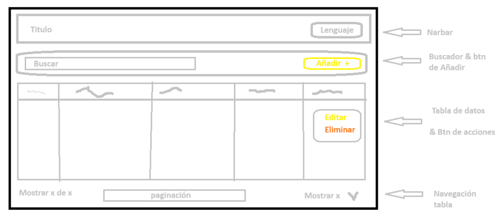

# Financial Product App

Esta aplicación es una solución basada en Angular para gestionar productos financieros (como tarjetas de crédito, cuentas de ahorro, etc.) de manera dinámica. Permite buscar, paginar, ordenar, registrar, editar y eliminar productos financieros. También cuenta con un sistema de traducción dinámico en tiempo real para Español e Inglés.

## Maquetación de la Interfaz

A continuación se muestra la maquetación base utilizada para diseñar y distribuir los elementos de la interfaz de la aplicación:



## Arquitectura del Proyecto

El proyecto sigue una estructura limpia y escalable organizada por modulos:

- **Core (core/)**: Contiene los servicios globales de la aplicacion que deben tener una sola instancia en el ciclo de vida (como `TranslationService`), modelos de datos compartidos (`product.model.ts`), guards de proteccion de rutas (`ProductExistsGuard` y `UnsavedChangesGuard`), y diccionarios de traduccion externos en `i18n/` (`en.ts` y `es.ts`).
- **Shared (shared/)**: Contiene componentes de interfaz reutilizables e independientes del contexto de negocio (`app-button`, `app-input`, `app-dropdown`, `app-modal`, `app-skeleton`), directivas, y la tuberia personalizada `TranslatePipe`.
- **Features (features/)**: Agrupa los modulos de negocio de la aplicacion. En este caso, el modulo `products` gestiona las vistas de listado (`list`) y formulario de registro/edicion (`form`), sus servicios especificos (`ProductService`), y componentes locales (`ContextMenuComponent`).

## Guards de Ruta

La aplicacion cuenta con dos guards principales para proteger el flujo de navegacion:

- **ProductExistsGuard**: Protege la ruta de edicion (`/products/edit/:id`). Consulta al backend para verificar si el ID del producto es valido y existe. Si no es valido, bloquea la entrada y redirige al listado.
- **UnsavedChangesGuard**: Protege las rutas del formulario (`/products/add` y `/products/edit/:id`). Si el usuario ha editado campos del formulario y navega fuera sin guardar, muestra un dialogo de confirmacion para evitar la perdida accidental de cambios.

## Tecnologias y Versiones

Las tecnologias principales y dependencias utilizadas en el desarrollo de la aplicacion son:

- **Angular**: version 14.2.0
- **Angular CLI**: version 14.2.13
- **RxJS**: version 7.5.0
- **TypeScript**: version 4.7.2
- **Jest**: version 28.1.3 (utilizado como framework de pruebas unitarias en sustitucion de Karma/Jasmine)
- **CSS / SCSS**: Estilos nativos y estructurados con variables globales para soportar un diseño premium

## Configuracion del Proxy y CORS

Para conectar la aplicacion frontend con los servicios del backend se ha configurado un proxy de desarrollo en el archivo `proxy.conf.json`.

Dado que las peticiones directas al backend estaban siendo bloqueadas debido a politicas de CORS (Cross-Origin Resource Sharing), se opto por adaptar la configuracion de la aplicacion cliente en lugar de modificar el backend. El servidor de desarrollo de Angular redirige las solicitudes realizadas bajo la ruta `/bp` hacia el servidor backend local (`http://localhost:3002`), eludiendo las restricciones de CORS en el entorno local.

## Instalacion y Ejecucion

Siga estos pasos para instalar y ejecutar el proyecto localmente:

### Requisitos Previos

Asegurese de tener instalado Node.js (se recomiendan versiones 16 o 18 LTS) y npm en su sistema.

### 1. Instalar las dependencias

Ejecute el siguiente comando en la raiz del proyecto para descargar e instalar todas las dependencias necesarias:

```bash
npm install
```

### 2. Levantar el servidor de desarrollo

Inicie el servidor local ejecutando:

```bash
npm start
```

Este comando compila la aplicacion y levanta un servidor de desarrollo. Ademas, carga de forma automatica la configuracion de proxy definida.
Abra su navegador en la direccion `http://localhost:4200/` para ver la aplicacion.

### 3. Ejecutar las pruebas unitarias

Para correr las pruebas unitarias con Jest en modo de ejecucion unica, utilice:

```bash
npm test
```
